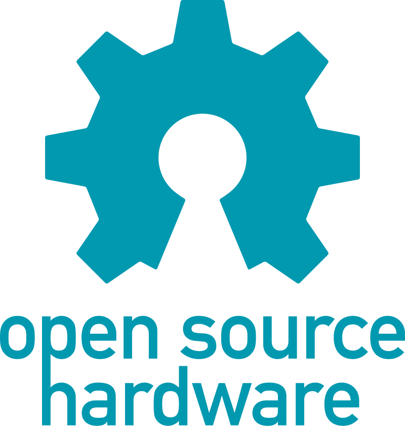

  

  
  
    
  
  
  

<h1 align="center">Open Bench Tools</h1>

  <strong>DIY Open Source Tools for your electronics workbench.</strong> 
  Practical, modular, and accessible projects for makers, students, and professionals. 
  <em>Our mission is to provide accessible, robust, and open-source tools to make life easier on electronics workbenches worldwide.</em>

 

## 🚀 Featured Projects

### Power Tools
- **OB-PowerSupply** - Adjustable bench power supply (0-30V) with current limiting
- **OB-Load** - Precision electronic load with display control
- **OB-SolderingIron** - Open-source temperature-controlled soldering station

### Measurement Tools
- **OB-Meter** - Multi-function bench meter (voltage, current, resistance)
- **OB-Scope** - Compact oscilloscope for basic measurements
- **OB-Logger** - Data logger with SD/USB storage

### Signal Tools
- **OB-Gen** - Function generator (sine/square/triangle waves)
- **OB-Switch** - Smart relay switching module with IoT control

### Workbench Organization
- **OB-Drawers** - Modular workbench drawer system
- **OB-Storage** - Stackable component bins with labeling system

> See all projects on our GitHub Organization

---

## 🔧 Simplicity First

At Open Bench Tools, we believe that open-source hardware should not only be functional but also **simple to build, assemble, and understand**.  
All our projects are designed with:
- Common and easy-to-find components.
- Clear and minimal documentation.
- Focus on reproducibility by makers and small labs.

Our goal is to make advanced bench tools **accessible to everyone**, from beginners to experienced professionals.

---

## 🛠 Design & Development Tools

We adopt **open-source and cross-platform tools** for the entire lifecycle of our projects:

### Hardware Design
- [KiCad](https://www.kicad.org/)  
  Open-source EDA (Electronic Design Automation) suite used for schematic capture, PCB layout, and documentation.

### Enclosure and Mechanical Design
- [FreeCAD](https://www.freecad.org/)  
  Open-source 3D CAD software used to design all enclosures and mechanical parts, which are made available for **3D printing**.

### Firmware Development
- [PlatformIO](https://platformio.org/)  
  Modern and powerful embedded development platform supporting multiple boards, frameworks, and toolchains.
- [Arduino](https://arduino.cc/)  
  Widely adopted and beginner-friendly firmware framework, ensuring easy adoption by the community.
- [Visual Studio Code](https://code.visualstudio.com/)  
  Cross-platform code editor, used with PlatformIO and Arduino for streamlined development.

---

## 🤝 How to Contribute

Whether you're a beginner or an experienced maker, your contribution is welcome! Here are some great ways to get involved:

- Use our projects and [share](mailto:tiagodepaulasilva@gmail.com) photos, demos, or feedback with us.
- Report bugs or suggest improvements by opening Issues.
- Propose new project ideas or help expand existing ones.
- Improve schematics, PCB layouts, or BOMs (cleaner design, cheaper parts, better sourcing).
- Create educational content — explain how a circuit works, introduce components, or break down key concepts.
- Design and share mechanical parts like enclosures, panel cutouts, or printable STLs.
- Help write or improve documentation, build guides, and assembly instructions.
- Translate documentation into other languages to make it accessible to more people.
- Share your forks, modifications, or remixed versions.
- Record short videos or timelapses of your builds or setups.

---

  

  Released under the <a href="LICENSE">CERN Open Hardware Licence Version 2 - Weakly Reciprocal (CERN-OHL-W)</a>

